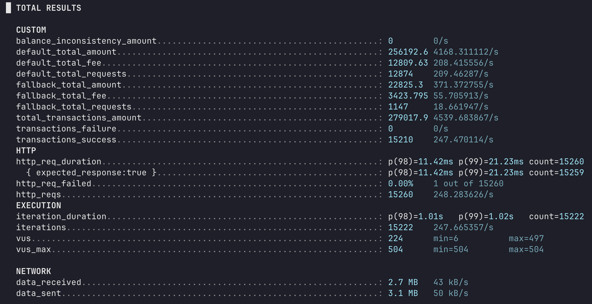

# Rinha de Backend 2025

## Tecnologias utilizadas

- **Linguagem:** Go
- **Armazenamento/Fila:** Redis
- **Balanceador:** Nginx
- **HTTP:** Fiber
- **Orquestração:** Docker Compose

## Como rodar
    Para rodar este backend basta rodar o comando `./start.sh`, em sua primeira execução talvez seja necessário realizar um `chmod 777 start.sh` para assim ficar disponível a sua execução.

    O backend ficará disponível na porta **9999**.

## Sobre a solução

    Este projeto foi desenvolvido utilizando Go e o framework http `fiber`, foi utilizado `redis` como mecanismo de cache e único banco de dados, e também para processamento de Filas. Sobre a arquitetura do projeto ele é estruturado de forma em que as requisições chegam e são enviadas para uma fila a fim de serem processadas de acordo com as disponibilidades de Workers. Em paralelo um HealthCheckWorker verifica os status dos endpoints default e fallback, salva em cache a melhor possibilidade de uso no momento atual.

## Resultado de teste local

